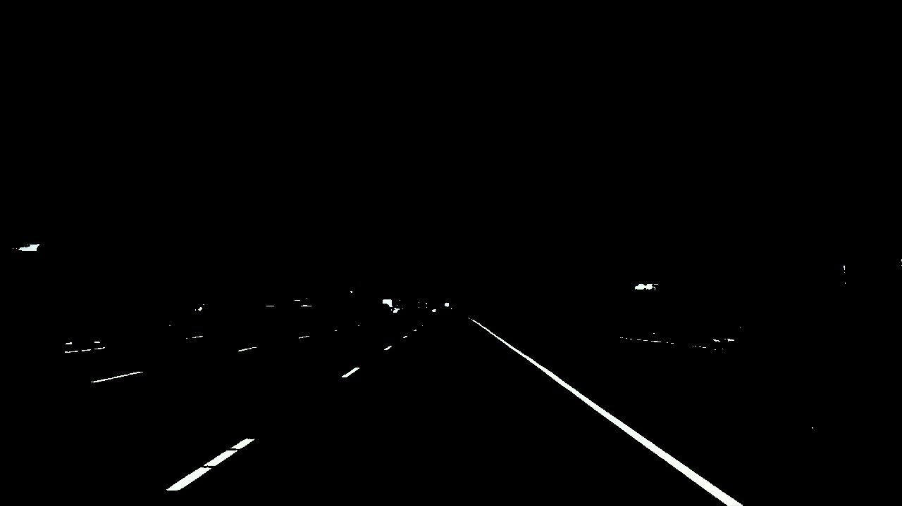

# Line detection by color and zone of interest Simple algorithm of a single image before taking out to line dection of a streamed video. We will only can find perfect-white line with this algorithm, which is very limited in reality. However, it's keep easy to understand before moving to something more sophisticated. """ @author: nguyenrobot

Firstly, we read the image and find some caracterstics of loaded image

Format: 

We will define RGB thresholds for color selection, we will only chosse pixels that are near to white.

We will define our zone of interest defined by a simple triangle to eliminate any un-welcomed detection.

