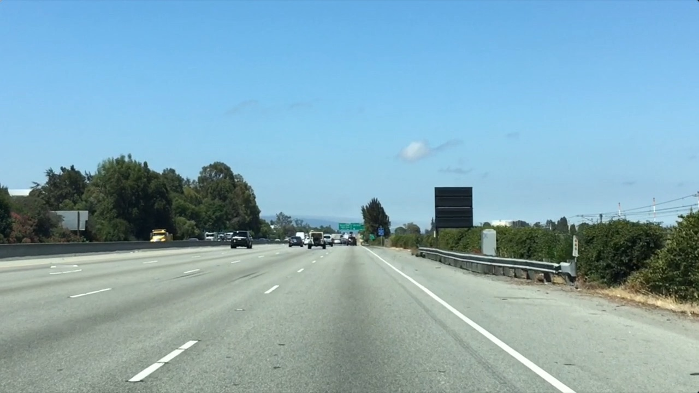

Line detection by color and zone of interest Simple algorithm of a single image before taking out to line dection of a streamed video. We will only can find perfect-white line with this algorithm, which is very limited in reality. However, it's to keep easy to understand before moving to something more sophisticated.  
@author: nguyenrobot
Main script :  line_detection_by_color_zone_interest.py
Main jupiter notebook : line_detection_by_color_zone_interest.ipynb

Firstly, we read the image and find some caracterstics of loaded image

Image Credit : Udacity

We will define RGB thresholds for color selection, we will only chosse pixels that are near to white.

We will define our zone of interest defined by a simple triangle to eliminate any un-welcomed detection.

In the end, we obtain a quite acceptable line detection result based on color slection and zone of interest :

